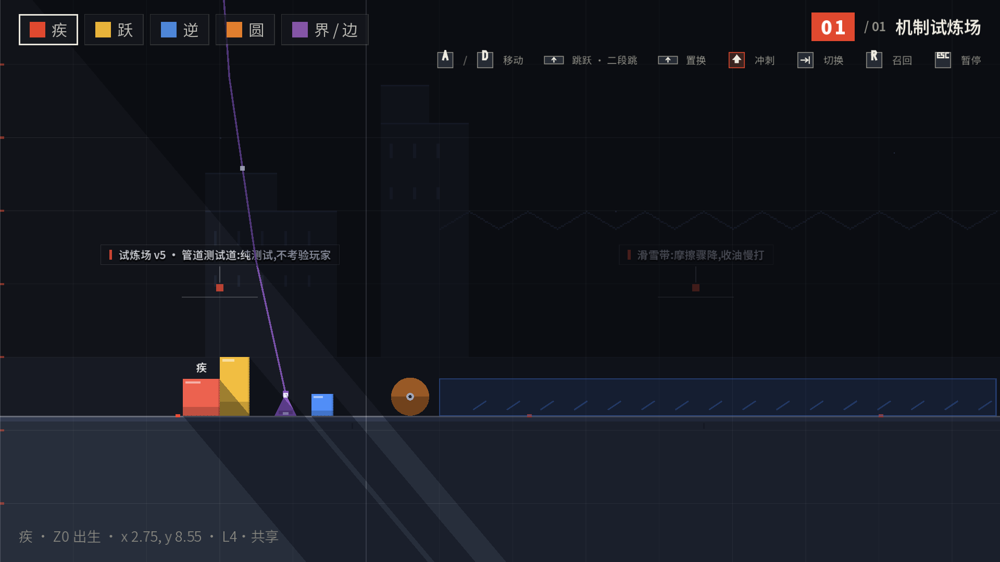
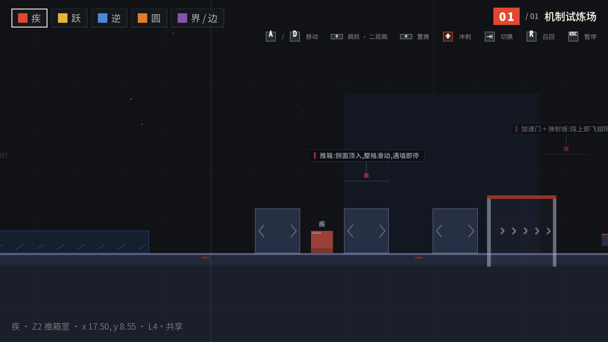
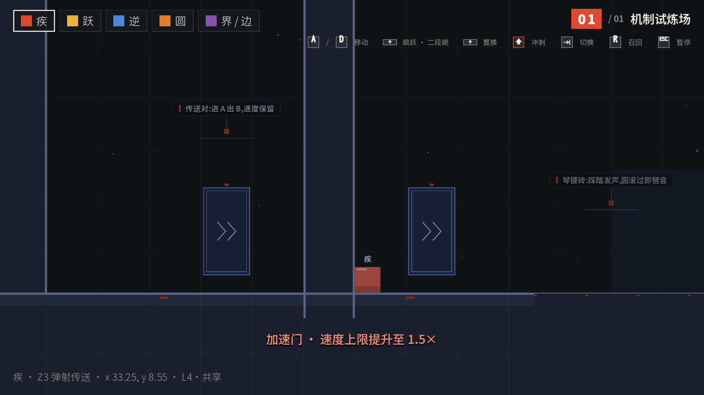
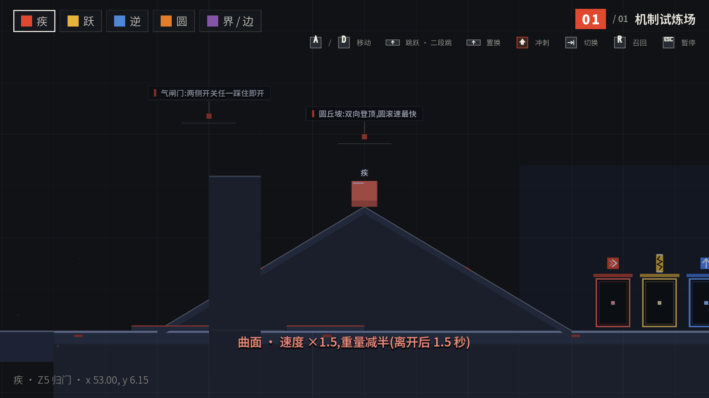

# 几何构成 GEOMETRIC CONSTRUCT

> 仓库 **geometric-construct** · 构成主义几何肉鸽游戏 · **Godot 4.7**(GDScript 2.0)

致敬《Thomas Was Alone》的 platformer 底子,以**构成主义**为美术与演出语言:
五位几何体——**疾**(红方 · 冲刺/爬墙)、**跃**(黄竖长方 · 强反弹/承载)、
**逆**(蓝镜像方 · 重力置换)、**圆**(橙圆球 · 惯性滚动/切线飞跃)、
**伍**(紫三角双子「界/边」· 磁力边界)——
各持一种"形状即性格"的能力,合作闯关、抵达终点门。
**机制完善期进行中**:正式关卡与剧情设计仍待机制完美(2026-09-10 决策);
现有可玩内容 = **机制试炼场**(机关全览)+ **伍试水 · 界与边**(双子试水)
+ **第一幕「各自的路上」六场**(疾速 / 弹阶 / 对面 / 坡道 / 双生阶 / 合演)
+ **肉鸽模式「重跑 RE-RUN」**(四位主角各一条三章节目链)。

当前版本 **v0.43.0**(唯一来源 `scripts/core/version.gd`,变更明细见 [CHANGELOG.md](CHANGELOG.md))。

## 预览

## 当前内容

- **剧目 REPERTOIRE**:唯一在演 **机制试炼场 v5 · 管道测试道**(功能测试)——
  地板与天花板并行的直通道,aseprite 绘制地图外观;机关沿地板一线排开:
  滑雪带 → 推箱室 → 加速门+弹射板 → 传送对 → 琴键砖 → 躲避动板 →
  限时桥坑 → 气闸门 → 圆丘坡 → 归门(含伍壁龛);纯测试不考验玩家。
  「关卡设计」幕锁定,机制达标后重启(七幕主纲已就绪)。
- **同屏双人「双人试炼」**(net.md §3,N1):标题菜单入口,双活模型
  (P1 疾 / P2 跃 各控各的,无切换);键盘分区(WASD+Shift /
  方向键+Ctrl)+ 双手柄独占(0 / 1 号柄),触屏设备 P1 触屏 + P2 手柄;
  镜头双人双取景动态缩放,roster chips 双人描边高亮(P1 纸白 / P2 橙)。
- **分层语义 v3**(levels.md §7.10):八层定值 L1–L8 × 双归属
  (`layer` 所在图层 + `who` 交互几何体集合)+ 组件编号 id;
  **高亮三档**——专属件按受控几何体色描边脉冲、共享件常亮、
  无关件幽灵暗化,全部机关物参与(所见即所碰)。
- **档案几何**(ui-flow.md §3,五页签全面档案库):几何体档案 ×
  建筑物图鉴 × 机关图鉴 × **键位指南(多端一册,`ArchiveData.CONTROLS`)** ×
  剧情回顾;图鉴示例图全部由 aseprite 绘制
  (统一 200×200 画布,`assets/archive/` 唯一入引擎目录,管线见
  art-style.md §6.1),动态构件以**多帧精灵**在图鉴内循环播放
  (终点门吸入 3 帧 / 限时桥 1s 循环 / 传送对规划条目 3 帧);
  手柄支持(十字键翻页 / LB·RB 切页 / B 返回)+ 安全区自适应版面;
  条目走纯数据表 `ArchiveData`,新增条目零代码。
- **坐标化辅助设计**(levels.md §8,Dimensions 量尺表已生效):
  净空 / 走道 / 坡度 / 台阶全从量尺表推导;zones 分区坐标系与
  `--gridcheck` 校验器已定稿待实装。
- **机制**:二段跳、踩头承载与超载减半、重力置换(逆)、纯滚动与
  曲面板切线飞跃(圆)、爬墙(疾)、磁力边界(伍双子,唯逆可穿)、
  加速门(2.5×)、移动构件(摆渡 / 电梯)、动态构件(限时桥 / 开关门——
  一门多开关的气闸式互让);**玩法机制群(v0.27)**:推箱(格逻辑
  整格滑动)、滑雪带(低摩擦覆盖带)、传送对(进 A 出 B 速度保留)、
  弹射板(固定矢量发射)——辅助玩法丰富度,非主题玩法。
- **音效**:程序化芯片音效引擎,C 大调音级;v0.27 起 SFX 总线全域
  低通柔化(5.2kHz),尖峰方波层换三角波/正弦——不刺耳不尖锐。
- **剧情**:Konado 驱动的序幕(七拍)、重跑序说与主角单章、尾声;
  「档案几何 · 剧情回顾」页签以**全文本阅读器**回看(台词按角色着色)。
- **表现**:程序化芯片音效引擎(零音频文件)、动态标题与 UI 动效体系
  (动效法则 M1–M9)、构成主义几何视差背景、关卡引擎光影实算
  (投影不再手绘)。
- **平台**:Windows / Android 导出预设;触屏设备自动启用虚拟轮盘 + 跳跃域;
  全程手柄可玩(菜单 / 档案面板已适配)。

## 操作

| 操作 | 输入 |
|---|---|
| 移动 | A/D · ←/→(触屏:左半屏轮盘) |
| 跳跃 / 二段跳 / 置换 | Space / W / ↑ / 手柄 A(触屏:右半屏点按) |
| 冲刺 | Shift / 手柄 X(触屏:轮盘拉满) |
| 爬墙(疾) | 贴墙 + 朝墙方向;按住跳跃 = 攀升 |
| 切换几何体 | Tab / Q·E / 1-5 / 手柄 LB·RB(双子同键连按轮换) |
| 召回(回最近检查点) | R / 手柄 Back / 右上按钮 |
| 重新开始关卡 | 暂停页「重 新 开 始」按钮 |
| 档案几何(图鉴 / 剧情回看) | C / 菜单入口;面板内:Q·E 切页签 / A·D 切条目 / 十字键翻页 / LB·RB 切页 / B 或 Esc 返回 |

完整规则(承载、弹性、曲面叠乘、1 格 = 100 px 标尺)见 `docs/DESIGN.md` 速查表。

## 快速开始

1. `git clone` 本仓库;
2. **安装第三方插件(必做,见下文[第三方插件](#第三方插件))**——`addons/` 整体不入库,
   konado(剧情)与 godot-ai(开发辅助,可选)均需自行安装;
3. 用 **Godot 4.7** 打开项目,在项目设置中启用 konado(开发期另加 godot-ai)后直接运行(主场景 `scenes/Main.tscn`)。

导出:已配置 **Windows Desktop** 与 **Android** 两个导出预设(`export_presets.cfg`)。

## 开发与验证

开发用 CLI 截图 / 自动验收钩子(`godot --path . -- --autotest=<关卡号>` 等):
`--autotest` / `--autoshot` / `--menushot` / `--panelshot`(档案几何全页签) /
`--doorshot` / `--introshot` / `--tourshot`(巨构巡航) / `--laneshot`(分层八层验收) /
`--trialshot` / `--recalltest`(召回链路自测) / `--rogueautotest` / `--perflog` /
`--level=` / `--leveljson=`。
自动验证场景见 `tests/`(机制断言 + 截图);发版规范与检查单见 `docs/UPDATE.md`。

## 文档索引

| 文档 | 内容 |
|---|---|
| [docs/ARCHITECTURE.md](docs/ARCHITECTURE.md) | 代码结构与分层规范(唯一权威) |
| [docs/DESIGN.md](docs/DESIGN.md) | 设计速查表 + `docs/design/` 分类档案索引 |
| [docs/ASSETS.md](docs/ASSETS.md) | 游戏内名称名词与资产统计速查(几何体 / 建筑 / 机关 / 词条 / 剧情 / 关卡)|
| [docs/ROADMAP.md](docs/ROADMAP.md) | 后续方向:地图编辑分享 / 同屏双人 / 联机 / 肉鸽 |
| [docs/UPDATE.md](docs/UPDATE.md) | 版本号 / 存档兼容 / 内容包 / 发版检查单 |
| [CHANGELOG.md](CHANGELOG.md) | 全部版本变更记录 |

## 第三方插件

| 插件 | 版本 | 说明 | 源仓库 |
| --- | --- | --- | --- |
| Konado | 2.7.4 | 对话系统 / 剧情向游戏工具包(**未随本仓库分发,需自行安装**) | <https://github.com/godothub/konado> |
| godot-ai | 3.2.5 | MCP / AI 开发辅助插件,仅开发期使用(**未随本仓库分发,需自行安装;导出包已排除**) | <https://github.com/hi-godot/godot-ai> |

### 安装插件(克隆后必做)

本仓库**不包含** `addons/` 下任何插件(整体在 `.gitignore` 中排除);项目设置里的
自动加载(`KND_I18n` / `_mcp_game_helper`)与启用插件列表都引用它们,
缺插件时启动会报错、剧情不可用。两个插件分别安装:

- **Konado**(≥ 2.7.4):从 [godothub/konado](https://github.com/godothub/konado) 下载,
  解压 `konado/` 到 `addons/` 下——剧情播放(序幕 / 第一幕 / 重跑 / 尾声)依赖它;
- **godot-ai**(≥ 3.2.5,可选,仅开发期):从 [hi-godot/godot-ai](https://github.com/hi-godot/godot-ai) 下载,
  解压 `godot_ai/` 到 `addons/` 下(导出预设已将其排除,不会进导出包)。

全部安装后,用 Godot 4.7 打开项目,在 **项目 → 项目设置 → 插件** 中启用。
`addons/` 已被 git 整体忽略,本地安装后不会被误提交。
