# UI/UX 图册 · UI GALLERY

> v0.29.1 全量界面截图归档 · **v0.47.1 全量重截**(v0.46 素材重绘后全屏刷新;boot 两屏未受影响沿用旧图):每屏 1280×720 设计稿基准,标注入口、主要
> 按钮/交互与状态对应。规范权威 = `docs/design/ui-flow.md`(六大 UX 空间、
> 页面规范模板、九态 UNKNOWN 链)与 `docs/ui/00-ui-master-plan.md`;
> 本图册是**视觉验收基准**,改任何 UI 前先对照,改完必须重截对应屏。
> 重截命令(`--` 后为 user args,桌面 1280×720):
> `--menushot / --actshot=0 / --panelshot / --setshot / --introshot --level=0 /
> --bootshot / --dualshot / --roomshot --shotdir=...`

## 开屏 BOOT(layer 60,总 2.4s 可跳过)

| 图 | 内容 | 交互 |
|---|---|---|
| 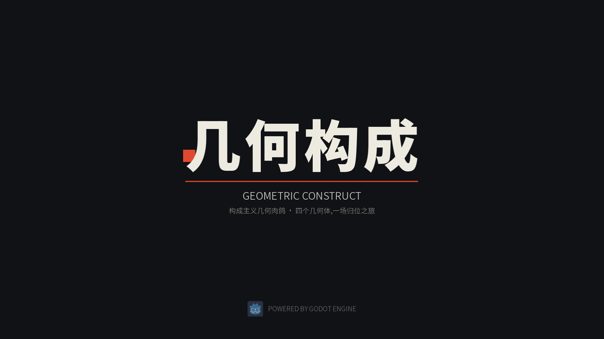 | 红色标记块硬立 + 「几何构成」逐字落位 | 点按/任意键跳过 |
| 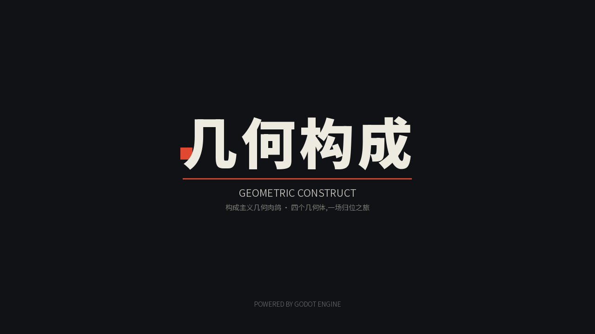 | 英文名 + 定位语 + 刻线横扫;底部引擎署名(**Godot 官方 logo**,非游戏图标) | — |

## 标题菜单 MENU(Main.State.MENU)

| 图 | 内容 | 按钮/交互 |
|---|---|---|
| 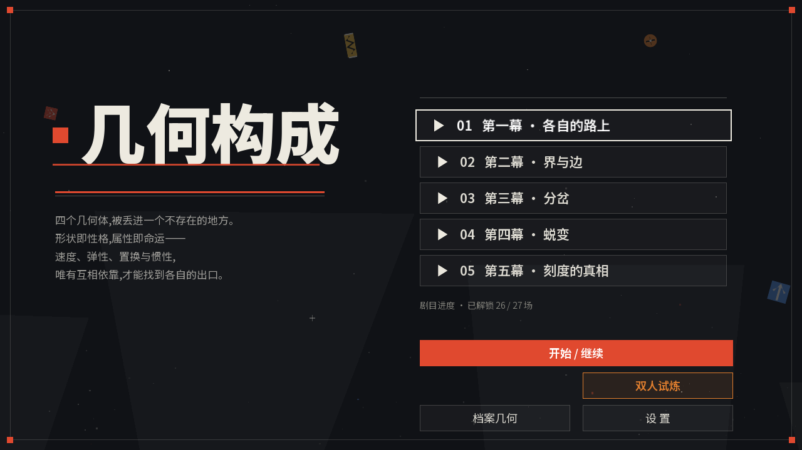 | 主页:左标题区 + 右剧目行 + 底部主按钮组 | 「开始/继续」(红=Primary)、「**双人试炼**」(橙=双人语言)、「档案几何」「设置」;数字键 1-4 快速选幕,C 档案,S 设置,Esc 退出 |
| 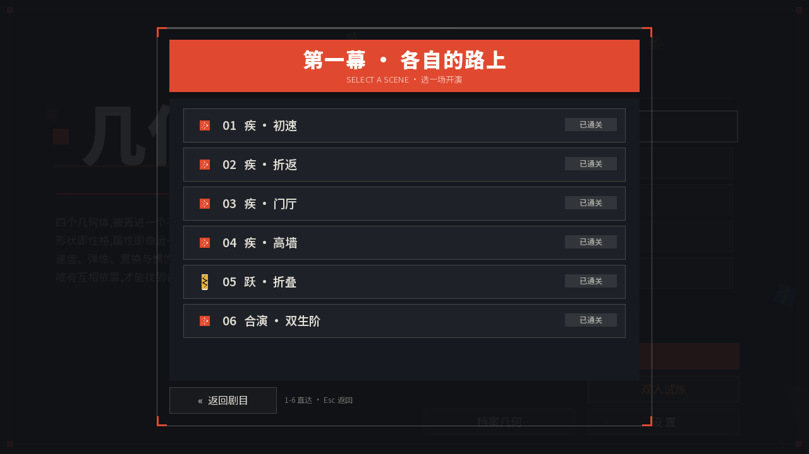 | 剧目二级菜单(关卡列,容器式卡片+角标) | 关卡行点击开演;未上演幕点击给错误音+toast;1-N 直达,Esc 返回 |

## 档案几何 ARCHIVE(面板带 38,五页签)

| 图 | 内容 |
|---|---|
| 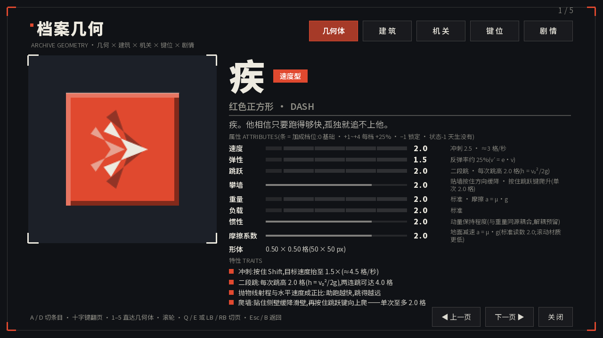 | 几何体档案页签(左列五位,右详情:肖像/数值/台词) |
| 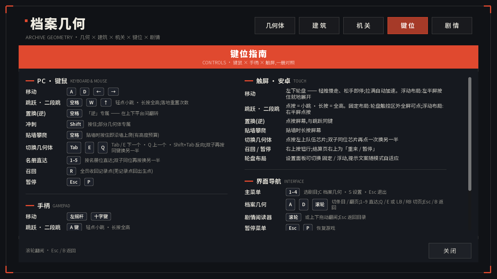 | 键位指南页签(**多端一册**:键鼠/手柄/触屏同册对照) |
| 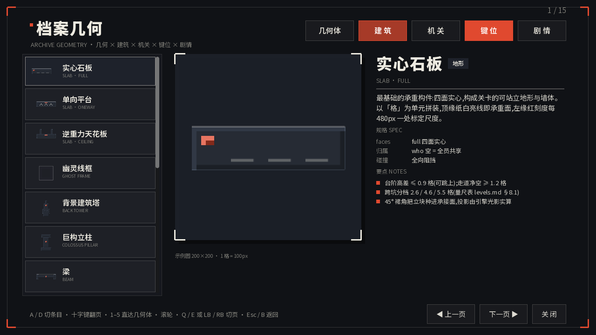 | 建筑页签(v0.46 重绘正典帧;左列图鉴,右规格/要点) |
| 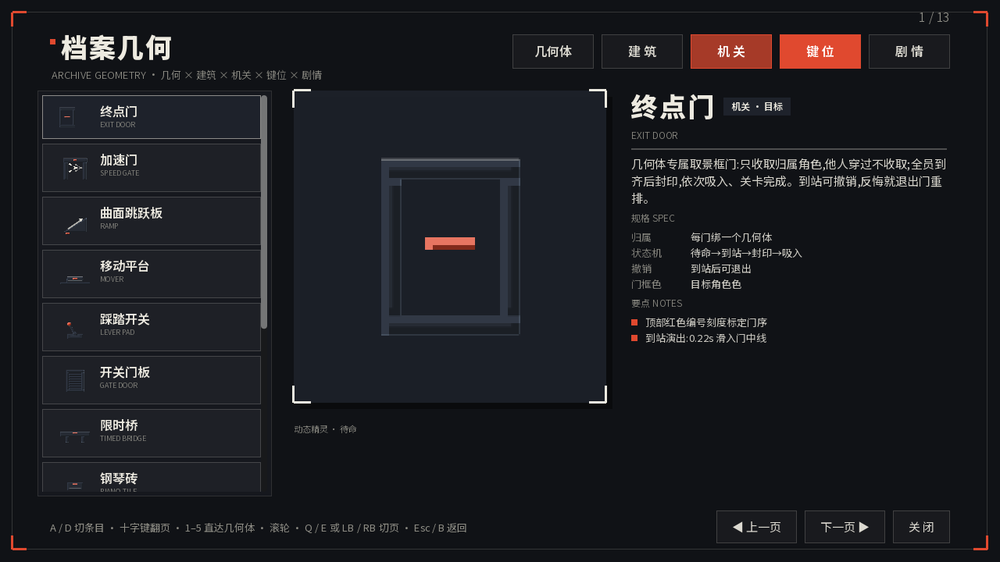 | 机关页签(同构;动态帧 f2/portal 见 `--panelshot`) |
| 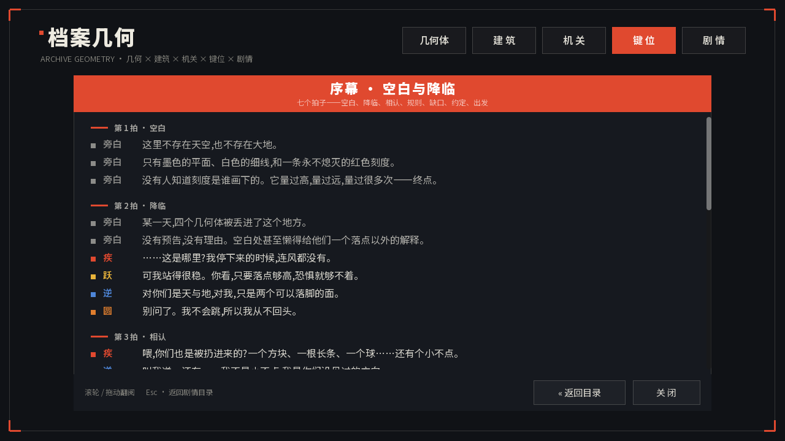 | 剧情回顾页签(全文本阅读器,台词按角色着色) |
| 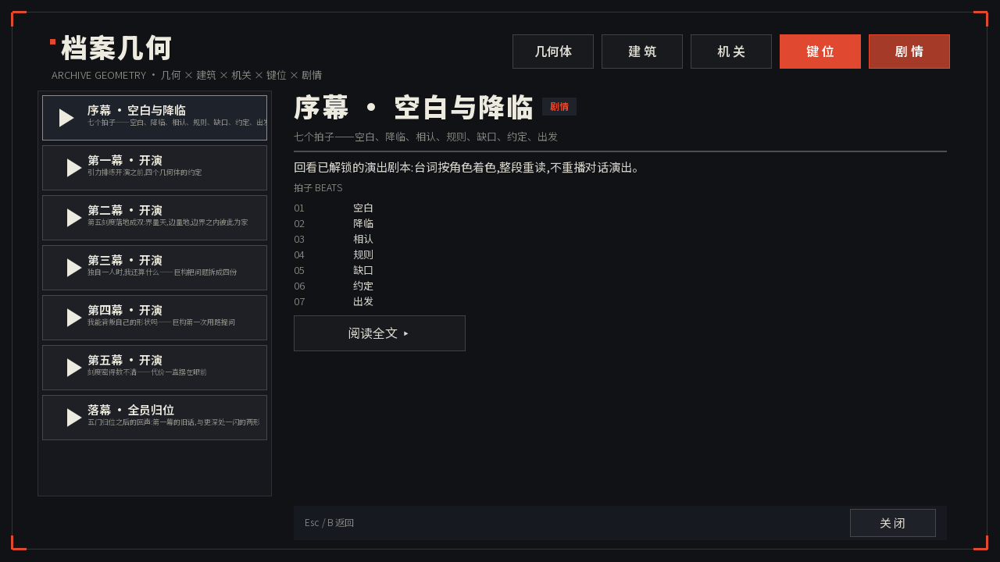 | 剧情目录页(五幕 + 落幕篇目,节拍预览) |

> 未归档同构页:geo1-4(其余四位)、bld_beam、mech_f2 / mech_portal(动态帧)——重截见 `--panelshot`。

## 设置 SETTINGS(面板带 38,与暂停共用)

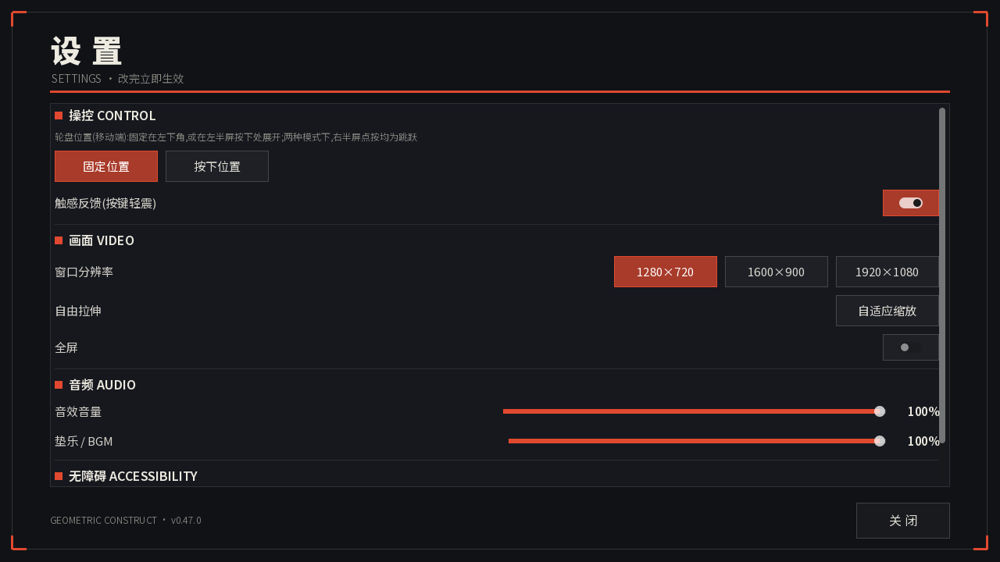
轮盘模式(fixed/float)/ 音效·环境音量 / 画面分辨率;手柄十字键翻页、LB·RB 切页、B 返回;设置持久化 `user://settings.cfg`。

## 局内 HUD(PLAYING)

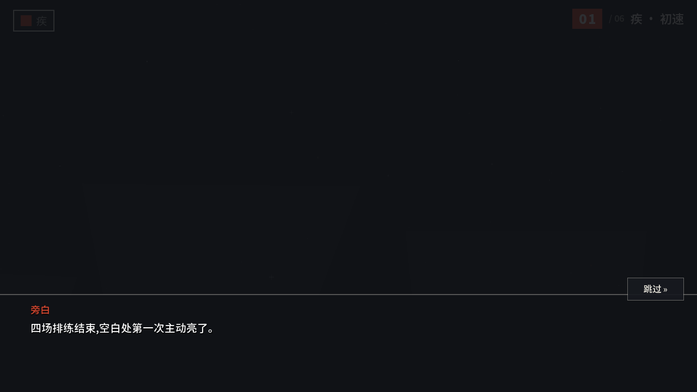
开场卡(幕·场次·几何体 + 定位语,右上跳过);常驻 HUD = 左上队伍 chips(当前受控描边+呼吸)、右上章节徽章、左下坐标读数、底部按键提示条(触屏自动换轮盘话术)。

## 同屏双人 N1(双活模型,net.md §3)

| 图 | 内容 |
|---|---|
| 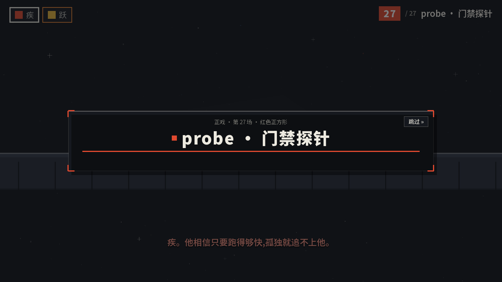 | 双活开局:chips 双描边(**P1 纸白 / P2 橙**)+ 双名牌;镜头双取景 |
|  | 分区输入可见证据:P1 右行 / P2 左行各自独立 |

## 跨设备双人 N2(net.md §4,Flow 型房间流程,带 30)

| 图 | 内容 | 交互 |
|---|---|---|
| 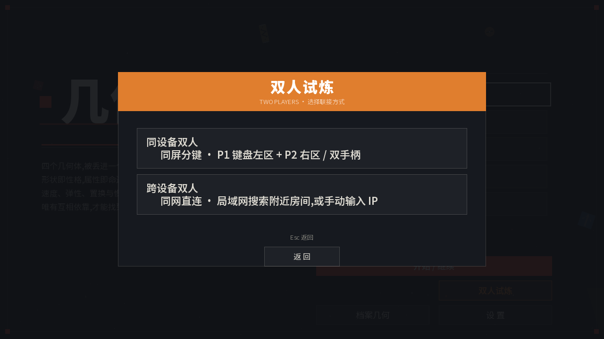 | 联接方式选择(橙题头):**同设备双人**(触屏设备置灰"移动端不可用")/ **跨设备双人** | 点选进入;Esc 返回 |
| 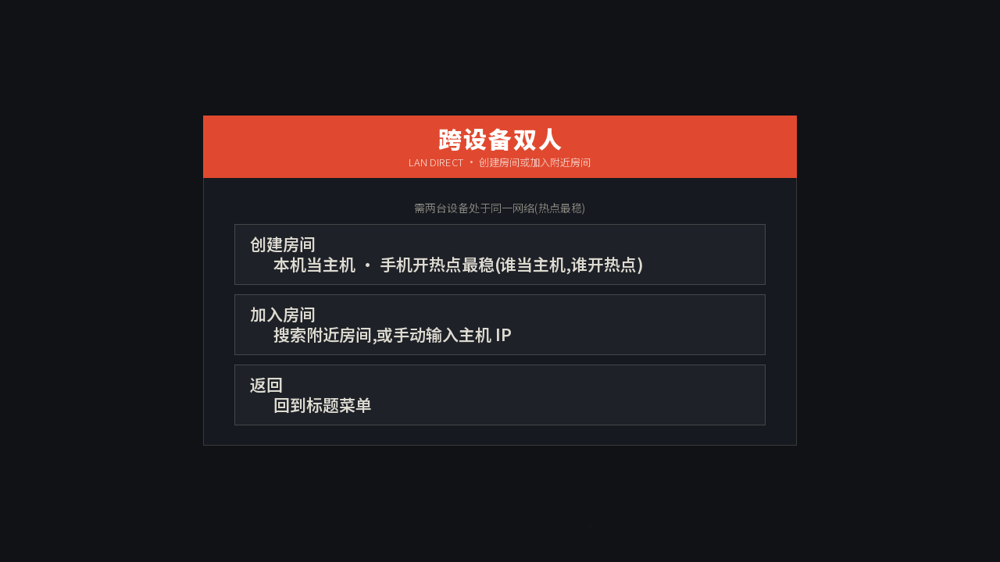 | 房间流程:创建 / 加入二选 | Esc 回标题 |
| 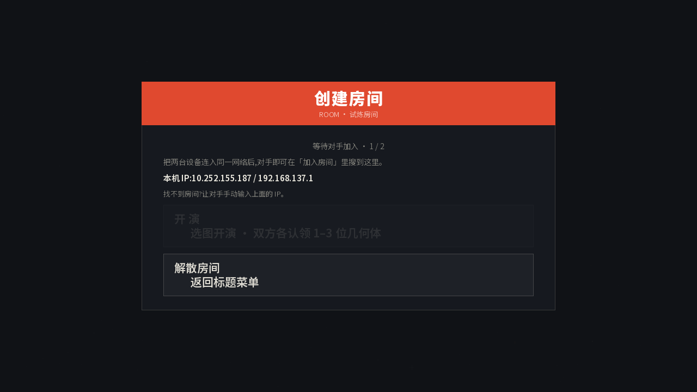 | 创建房间:本机 IP 常驻、等待对手 ×/2、满员解锁「开演」 | Esc 解散回标题 |
| 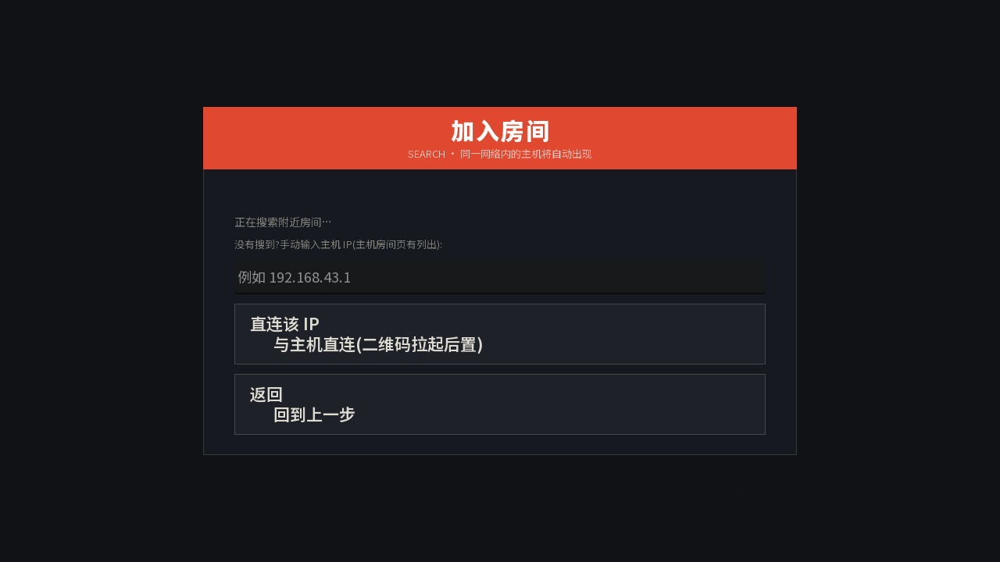 | 加入房间:附近房间列表(版本/满员门禁标灰)+ 手动 IP 兜底 | Esc 停止搜索 |

## 纪律

- 新增/改动任何页面:**本图册对应图必须同一次交付内重截**。
- 截图统一 1280×720;真机安全区验收另照 MIUI 实机(图册不替代)。
- 图册不含玩法演出图(机关/机制演示走 `docs/preview/` 与 `--tourshot`)。
